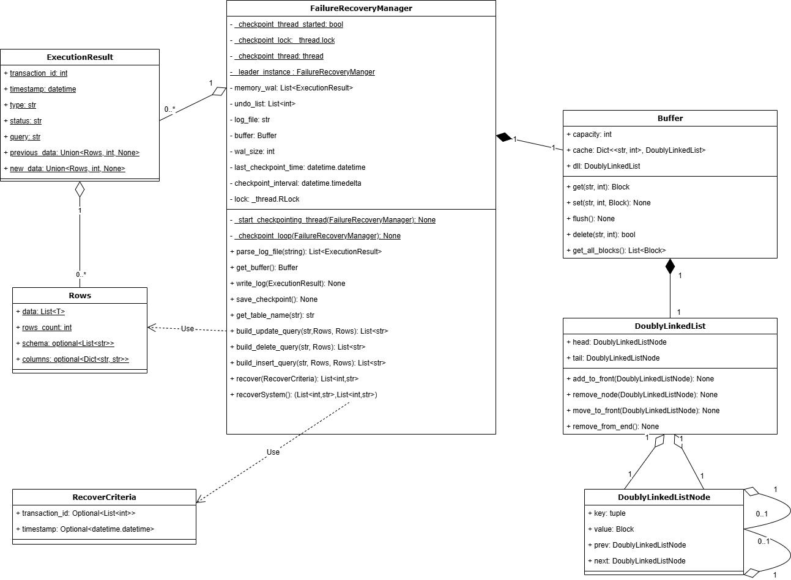

# Failure Recovery Process and Unit Test Guide
**Failure Recovery**
|NIM	|Name|
| ------------- | ------------- |
13522055	|Benardo
13522012	|Thea Josephine Halim
13522100	|M. Hanief Fatkhan Nashrullah
13521026	|Kartini Copa

## 1. Failure Recovery Process

The failure recovery process ensures that the database system can recover from crashes or failures while maintaining consistency and durability. This process is divided into several classes, each with a specific role in recovery operations.

### **Class Descriptions**

- **`FailureRecoveryManager`**:
  - The central component responsible for managing the recovery process.
  - Handles logging, checkpointing, undo/redo operations, and integration with storage and query processors.
  - Key Methods:
    - `recover()`: Handles undo operations for aborted transactions.
    - `recoverSystem()`: Executes the REDO and UNDO phases to restore the database.
    - `save_checkpoint()`: Writes a snapshot of the current state to disk.

- **`ExecutionResult`**:
  - Represents an individual operation or transaction in the Write-Ahead Log (WAL).
  - Attributes include transaction ID, type (e.g., `UPDATE`, `INSERT`), status, timestamp, and data before/after the operation.

- **`Rows`**:
  - Encapsulates rows of data involved in transactions, including schema details, number of rows, and the actual data.

- **Storage Manager Integration**:
  - Manages the flushing of in-memory data blocks to disk during checkpointing.
  - Ensures blocks are stored in files named after their table and offset for easy retrieval.

- **Query Processor Integration**:
  - Logs transactions using `write_log()` and handles rollback of aborted queries through `recover()`.

### **Failure Recovery Process Overview**

The process involves three key phases:
1. **Checkpointing**:
   - Periodically saves the current state to disk to minimize the amount of work needed during recovery.

2. **REDO Phase**:
   - Reapplies all committed transactions starting from the last checkpoint to ensure durability.

3. **UNDO Phase**:
   - Reverts changes made by aborted transactions to restore the database to a consistent state.

### Class Diagram

Below is a simplified class diagram illustrating the interactions between key components:

  
*Note: Replace the above placeholder URL with the actual class diagram image.*

---

## 2. How to Run Unit Tests

The project includes two test files:
1. **`unitTest.py`**: Tests the overall functionality of the failure recovery system.
2. **`test_buffer.py`**: Tests buffer management and its integration with the failure recovery system.


### **Steps to Run Tests**

1. **Navigate to the Project Directory**:
   Open a terminal and navigate to the project folder:
   ```bash
   cd Failure_Recovery
   ```
2. Run Tests for unitTest.py: Execute the following command:
    ```bash
    python -m unittest unitTest.py
    ```
3. Run Tests for test_buffer.py: Execute the following command:
    ```bash
    python -m unittest test_buffer.py
    ```

    